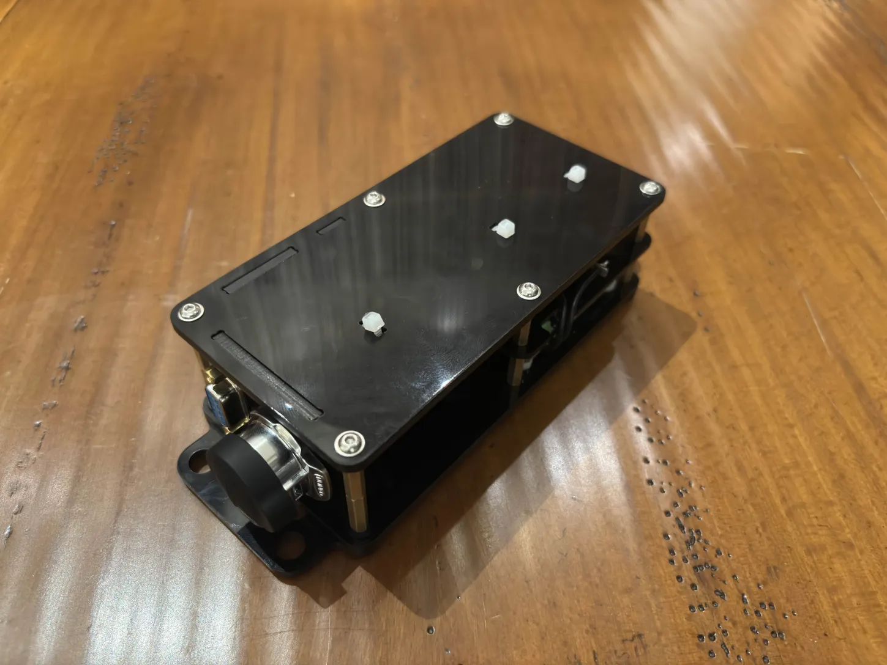
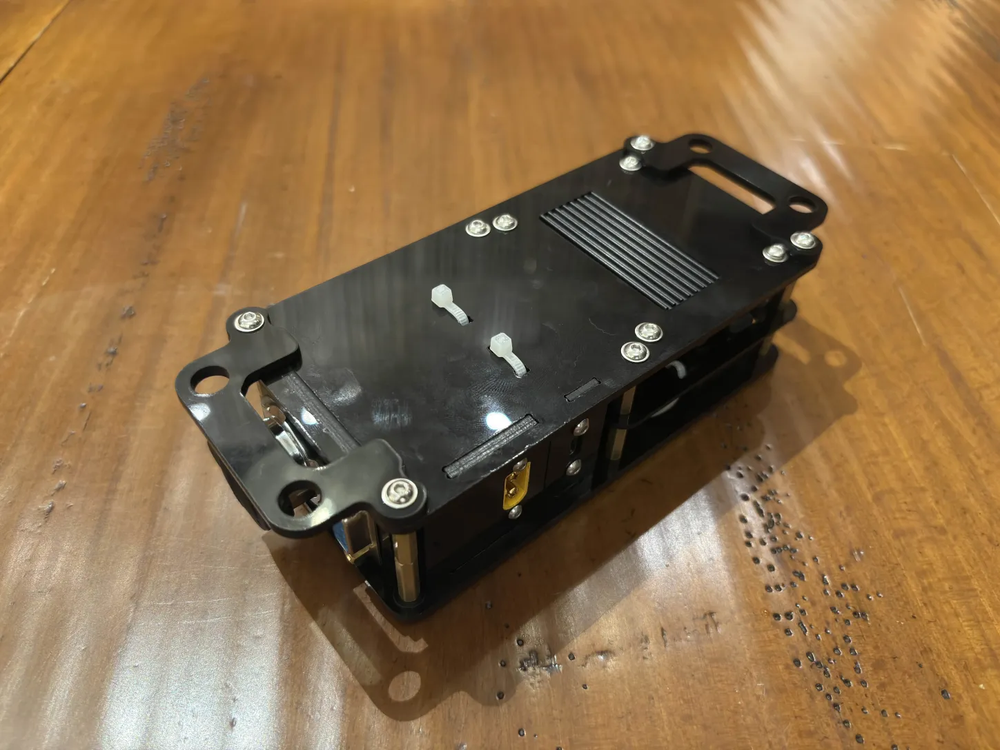

# FFBeast-control-box
This is an enclosure designed to house FFBeast steering wheel simulators' electronics.

## The project uses:
- [FFBeast](https://ffbeast.github.io/docs/en/wheel.html) as the controller firmware.
- An ODrive Mini as the electronic speed controller.
- A compact enclosure composed of mainly acrylic / Perspex. - all design files included.

## Compatibility:
- As long as you are using an Odrive/Xdrive Mini, there should be no problems with the enclosure.
- This enclosure is compatible with all motors & encoders, as long as they're compatible with FFBeast.

  
  

